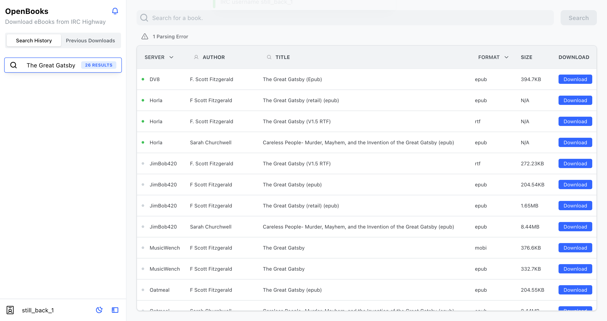

# openbooks (PotatoStack patched v5.0.0)

> Upstream: [evan-buss/openbooks](https://github.com/evan-buss/openbooks) at v4.5.0.
> This tree is the **PotatoStack patched line** (v5.0.0): real authentication, a
> REST API for the rest of the stack, fixed path-traversal and TLS issues, and
> no known-vulnerable standard library. See [Patch notes](#patch-notes-potatostack-v500)
> and [REST API](#rest-api-v500).

> NOTE: Going forward only the latest release will be supported. If you encounter any issues, be sure you are using the latest version.

[](https://hub.docker.com/r/evanbuss/openbooks/)

Openbooks allows you to download ebooks from irc.irchighway.net quickly and easily.

<picture>
  <source media="(prefers-color-scheme: dark)" srcset="./.github/home_v3_dark.png">
  
</picture>

## Patch notes (PotatoStack v5.0.0)

Changes relative to upstream v4.5.0, newest first:

- **Runtime settings + env config + test suite** (port of the fork's
  `a65ef3d` settings work, reconciled with the v5 token auth). New
  `server/settings.go`: `GET/PUT /api/v1/settings` changes the download
  directory and the persist flag on a running instance. The new dir is
  validated (absolute, not `/`, NUL-free) and its writability is *probed*
  before it is switched in, so a rejected change never leaves downloads
  pointed at a dead path. `cmd/openbooks` now seeds config from
  `OPENBOOKS_PORT` / `OPENBOOKS_DIR` / `OPENBOOKS_PERSIST` /
  `OPENBOOKS_RATE_LIMIT` / `OPENBOOKS_USER_AGENT` (short names accepted
  too); an explicitly set flag always wins. A 10-case test suite covers
  the traversal delete, name validation, list filtering, the token
  middleware (all three token forms), single-user mode, and settings.
  This also fixed a regression the v5 rewrite had introduced: with
  `persist` off, book download links now serve the file *then* delete it
  (upstream behavior) instead of 404ing.
- **Authentication.** New `server/auth.go`: when `OPENBOOKS_TOKEN` (or
  `--token`) is set, **every route except the static SPA and `GET /openapi.json`**
  requires the token via `Authorization: Bearer ***`, the
  `X-OpenBooks-Token` header, or `?token=*** (the only form a `<a download>`
  link or a browser WebSocket can carry). Constant-time compare. With no token
  set the server behaves exactly like upstream (single-user desktop mode).
  Upstream had no auth at all: the `OpenBooks` cookie was a client-generated
  UUID, and `/stats`, `/servers` and the library endpoints were open to anyone
  who could reach the port.
- **REST API.** New `server/api.go`: the whole search/download/library flow is
  now also available as REST under `/api/v1` (see [below](#rest-api-v500)),
  backed by a server-owned IRC session, so other services (DAGs, scripts,
  curl) no longer need a websocket client or a browser.
- **OpenAPI document.** `server/openapi.json` is embedded into the binary and
  served at `GET /openapi.json` (public - it is documentation, not data).
- **Path traversal fixed (library download).** `GET /library/{name...}` now
  validates the whole wildcard capture against the books directory with
  `safeJoin` instead of taking the last path segment. Subfolder books (the
  bookdl/filebot pipeline organizes into subdirectories) now download;
  `..%2F` sequences are rejected.
- **Arbitrary file deletion fixed (library delete).** `DELETE /library/{name}`
  used to `os.Remove` whatever `url.PathUnescape` produced from the single chi
  param - chi routes on the raw percent-encoding, so `..%2F..%2Fx` unescaped to
  a traversal *after* routing accepted it as one segment. Both error branches
  also fell through without returning. Now: one path segment only, separators /
  `.` / `..` / NUL rejected, plus a `filepath.Rel` containment check.
- **Archive extraction hardened** (`util/archiver.go`). archiver/v3 is
  unmaintained and its path-traversal advisories (GO-2024-2698, GO-2025-3605)
  plus the rardecode RAR dictionary DoS (GO-2025-4020) have no fixed release.
  `ExtractArchive` now resolves every archive entry against the download
  directory and rejects entries that escape it (`safeArchiveTarget`), rejects
  NUL/`.`/`..` names, and caps entry size at 5 GiB.
- **Archive extraction regression fixed** (`util/archiver.go`). The v5
  hardening above introduced a variable shadowing bug: the walk callback's
  `newPath, err :=` re-declared `newPath` in the closure scope, so
  `ExtractArchive` returned the `.zip` itself instead of the extracted text,
  and valid searches reported "No results found". Regression-tested by
  `TestExtractArchiveReturnsExtractedFile`.
- **Search parser no longer drops real results** (`core/search_parser.go`).
  The production parser (`parseLineV2`) hard-failed any line without a ` - `
  author separator (and assumed the separator when slicing the title,
  chopping 2 characters). Author-less and `::INFO::`-less lines now parse
  with empty author / `N/A` size; live result count went from 95/100 to
  99/100. `TestSpecialCases` (exact values) still passes.
- **IRC TLS no longer skips verification.** Upstream `irc/irc.go` dialed
  with TLS verification disabled. irchighway's backends serve self-signed
  certs with no SAN/CN, so hostname verification is impossible there; v5
  instead pins each backend's SHA-256 certificate fingerprint per host
  (`irc/irc.go`) and refuses any cert outside the pinned set. Any other
  `--server` gets strict verification. See `SECURITY.md`.
- **Join-race fix (kept from the v4.5.0-based local build).** `core.Join` no
  longer sleeps a fixed 2s after connect; it reads until the 001 welcome
  (definitive "registered" signal), answering PINGs, with a 20s fallback.
  Without this, VPN-egress connections joined before registration completed
  and every search silently failed (`451 ... :You have not registered`).
- **Bind address.** `--bind` (default `127.0.0.1`); the docker image passes
  `0.0.0.0` explicitly. Upstream bound `:port`, publishing the UI (and,
  pre-v5, the library) to every interface.
- **Standard library.** Built with go1.26.6 (16 reachable stdlib advisories
  from 1.26.0 cleared: crypto/tls, net/http, crypto/x509, net, os, net/url,
  encoding/asn1, net/textproto, archive/tar).
- **Docker image.** Non-root distroless runtime, pinned base images, `npm ci`
  for reproducible frontend builds. The stray `npm` runtime dependency in
  `server/app/package.json` (which dragged 5 vulnerable npm-CLI sub-packages
  into the production tree) is removed.
- **Frontend token support.** The React app stores a token in
  `localStorage["openbooks-token"]`, sends it on every REST call and websocket
  upgrade, and probes `/api/v1/health` on load: token set and healthy -> app;
  401 -> token prompt. No-token servers skip the prompt (health succeeds).
- **Rate limit / single-search semantics** carried over to the API: a second
  search while one is in flight gets `429`/`409`, same as the UI.

## Getting Started

### Binary

1. Download the latest release for your platform from the [releases page](https://github.com/evan-buss/openbooks/releases).
2. Run the binary
   - Linux users may have to run `chmod +x [binary name]` to make it executable
3. `./openbooks --help`
   - This will display all possible configuration values and introduce the two modes; CLI or Server.
4. Server mode with authentication (recommended for anything reachable by more
   than one person):
   - `./openbooks server --token *** --bind 127.0.0.1`

### Docker

- Basic config
  - `docker run -p 8080:80 evanbuss/openbooks`
- Config to persist all eBook files to disk
  - `docker run -p 8080:80 -v /home/evan/Downloads/openbooks:/books evanbuss/openbooks --persist`
- With an API token (recommended):
  - `docker run -p 8080:80 -e OPENBOOKS_TOKEN=*** evanbuss/openbooks --persist`

### Setting the Base Path

OpenBooks server doesn't have to be hosted at the root of your webserver. The basepath value allows you to host it behind a reverse proxy. The base path value must have opening and closing forward slashes (default "/").

- Docker
  - `docker run -p 8080:80 -e BASE_PATH=/openbooks/ evanbuss/openbooks`
- Binary
  - `./openbooks server --basepath /openbooks/`

## REST API (v5.0.0)

Full machine-readable spec: `GET /openapi.json` on the server (public).
Auth on every endpoint except that one: `Authorization: Bearer ***`,
`X-OpenBooks-Token`, or `?token=***

| Method | Path | Purpose |
|--------|------|---------|
| GET    | `/api/v1/health`        | name/version/persist; also the token probe |
| GET    | `/api/v1/library`       | list persisted books (name, size, mtime, download link) |
| GET    | `/api/v1/library/{path}`| download a book (subfolders allowed; traversal rejected) |
| DELETE | `/api/v1/library/{name}`| delete one top-level book file |
| POST   | `/api/v1/search`        | search `#bookz`; `{"query": "...", "wait": true}` returns results (120s cap) |
| POST   | `/api/v1/download`      | `{"book": "!"}` (identifier from search) requests the DCC download |
| GET    | `/api/v1/settings`      | current runtime settings (downloadDir, persist) |
| PUT    | `/api/v1/settings`      | change downloadDir (absolute + writable, probed before switching) and/or persist, no restart |

Search + download run in a server-owned IRC session, so the UI and the API can
share one server. DCC downloads are asynchronous: after `POST /download`
(200 `requested`), poll `GET /api/v1/library` until the file appears.

The legacy browser endpoints (`/ws`, `/stats`, `/servers`, `/library...`) are
also behind the token and still work, so the web UI needs no separate client
changes beyond the token prompt.

## Usage

For a complete list of features use the `--help` flags on all subcommands.
For example `openbooks cli --help or openbooks cli download --help`. There are
two modes; Server or CLI. In CLI mode you interact and download books through
a terminal interface. In server mode the application runs as a web application
that you can visit in your browser.

Double clicking the executable will open the UI in your browser. In the future it may use [webviews](https://developer.microsoft.com/en-us/microsoft-edge/webview2/) to provide a "native-like" desktop application.

## Development

### Install the dependencies

- `go get`
- `cd server/app && npm install`
- `cd ../..`
- `go run main.go`

### Build the React SPA and compile binaries for multiple platforms.

- Run `./build.sh`
- This will install npm packages, build the React app, and compile the executable.

### Build the go binary (if you haven't changed the frontend)

- `go build`

### Mock Development Server

- The mock server allows you to debug responses and requests to simplified IRC / DCC
  servers that mimic the responses received from IRC Highway.
- ```bash
  cd cmd/mock_server
  go run .
  # Another Terminal
  cd cmd/openbooks
  go run . server --server localhost --log
  ```

### Desktop App
Compile OpenBooks with experimental webview support:

``` shell
cd cmd/openbooks
go build -tags webview
```


## Why / How

- I wrote this as an easier way to search and download books from irchighway.net. It handles all the extraction and data processing for you. You just have to click the book you want. Hopefully you find it much easier than the IRC interface.
- It was also interesting to learn how the [IRC](https://en.wikipedia.org/wiki/Internet_Relay_Chat) and [DCC](https://en.wikipedia.org/wiki/Direct_Client-to-Client) protocols work and write custom implementations.

## Technology

- Backend
  - Golang
  - Chi
  - gorilla/websocket
  - Archiver (extract files from various archive formats)
- Frontend
  - React.js
  - TypeScript
  - Redux / Redux Toolkit
  - Mantine UI / @emotion/react
  - Framer Motion
